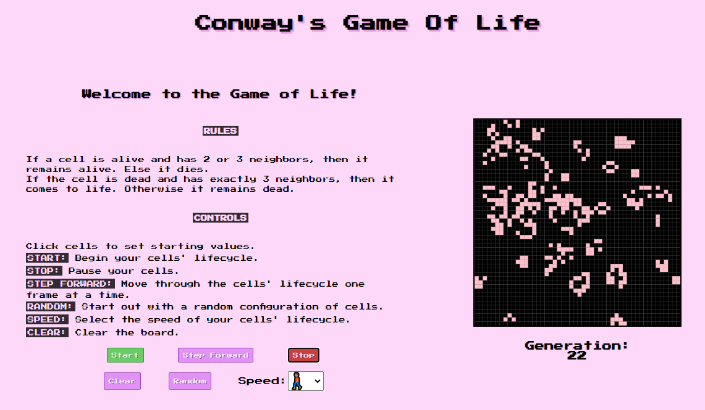

# The Game Of Life
An interactive in-browser version of [**Conway's Game Of Life**](https://en.wikipedia.org/wiki/Conway%27s_Game_of_Life) made using HTML Canvas.  

## Motivation
This was created as a project for school to demonstrate the ability to recreate the Game of Life from scratch, only being given the rules of the game. 

## Screenshots


## Tech/framework used

- [React](https://github.com/facebook/create-react-app)
- [HTML Canvas](https://developer.mozilla.org/en-US/docs/Web/HTML/Element/canvas)

## Features
- **Stop/Start** - start/pause the cells' lifecycle at any point.
- **Step Forward** - Move through the cells' lifecycle one frame at a time.
- **Set Initial Cells** - Click cells to create a starting configuration or to modify an existing one.
- **Random** - Begin the game with a random configuration of cells.
- **Speed** - Select from three speeds of the cells' lifecycle.
- **Generation** - Displays what generation of cells the game is currently on.

## How to use?
```
npm i
-----
npm start
```
